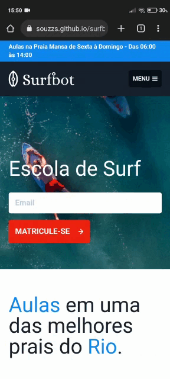
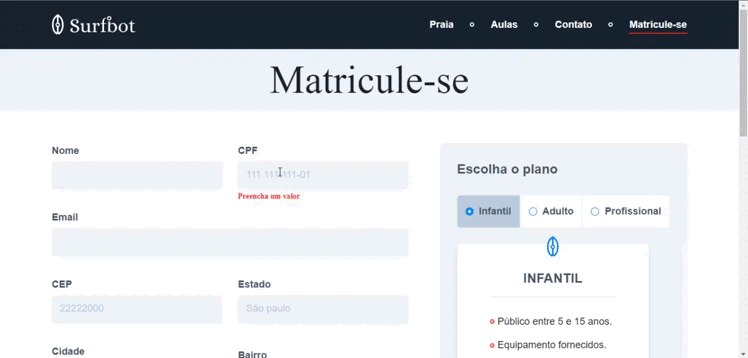
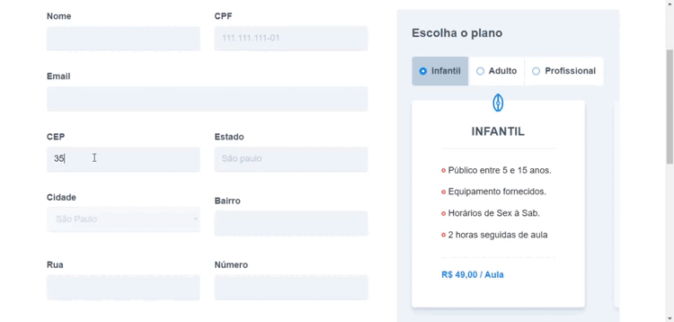

<h1 align="center">🌊 Surfbot 🌊 </h1>

Site para divulgação de uma das melhores escolas (fictícia) de surf.

 <a href="#sobre">Sobre</a> •
  <a href="#status">Status</a> •
 <a href="#funcionalidades">Funcionalidades</a> • 
 <a href="#instalacao">Instalação</a> • 
 <a href="#tecnologias">Tecnologias</a> • 
 <a href="#autor">Autor</a> • 
 <a href="#licenca">Licença</a>

  <h1>📎 Sobre. </h1>
  
 O projeto surfbot foi desenvolvido com o objetivo de aplicar o conhecimento em html e css e relembrar conceitos de javascript visto no curso técnico. Além disso o  sistema busca se aproximar de um projeto real, prático que poderia ser facilmente aplicado em um cenário real.
 
  
 O sistema apresenta duas páginas, uma para divulgação da escola e outra voltada para a compra dos planos ofertados. Ambas as páginas sofreram alterações do projeto principal para se adpatar as funcionalidades extras, que você pode encontrar em: <a href="#funcionalidades">funcionalidades</a>.
  

  
<em>Pse: Vale ressaltar que o layout e a ideia do projeto foram retirados do curso da <a href="https://www.origamid.com/">origamid</a>. Entretanto o projeto é feito no modulo de UI/UX Design da plataforma. Logo existe apenas o seu layout pronto, todo o código e detalhes foram feito à parte por mim.</em>

  <h1>✅ Status.</h1>
  
Atualmente o projeto se encontra <b>FINALIZADO</b> e pode ser vizualizado na imagem de demonstração abaixo ou acessado atráves do link: <a   href="https://souzzs.github.io/surfbot/">Surfbot online 🏄</a>.

  

  <h1>🔧 Funcionalidades.</h1>
  
Todas as funcionalidades envolvendo javascript foram adicionadas à parte do projeto principal para aplicar os conhecimentos na manipulação do DOM, sendo elas
  listadas e detalhadas abaixo.

  <ul>
    <li>
      <h3>Responsividade.</h3>
      
Apesar da responsividade não está diretamente ligada com javascript, o layout do projeto no figma contém apenas as telas para a versão desktop do sistema, logo toda a questão de responsividade foi feita por mim, sendo um ótimo momento para recordar conceitos de css. Abaixo podemos ver um exemplo do sistema acessado pelo mobile.

      

    </li>
    <li>
      <h3>Acessibilidade para mobile.</h3>
      
Com a versão mobile do site veio a necessidade de tratar os eventos de clique em elementos da tela, dado que a uma diferença entre o evento de clique no desktop e no mobile. Veja em seguida o resultado.

      

    </li>
    <li>
      <h3>Validação de inputs.</h3>
      
Apesar do formulário do sistema não ter uma reação a validação de inputs foi feita, visto que na maioria dos sistemas desenvolvidos sempre tem a necessidade de haver formulários. Logo foi uma ótima chance para aplicar alguns conhecimentos em regex. Olhe a validação em ação a seguir.

      

    </li>
    <li>
      <h3>Consumo de API.</h3>
      
Basicamente tudo na web hoje tem alguma parte assincrona, como isso entender como essa parte funciona no javascript é de suma importancia. Nesse caso optei por usar a <a href="https://viacep.com.br/">VIA CEP API</a> para puxar uma uf baseado no cep digitado e com esse dado em mãos consultar a <a href="https://servicodados.ibge.gov.br/api/docs/localidades">LOCALIDADES API IBGE</a> e listar as cidades em um select para o usuário selecionar. Confira.

      

    </li>
  </ul>

   <h1>ℹ️ Instalação.</h1>
  
Como o projeto foi feito com tecnologias básicas sua instalação é simples.

  <ul>
    <li>
      
Primeiro abra seu editor de texto e no terminal digite o seguinte comando:

      
<code>$ git clone https://github.com/souzzs/surfbot.git</code>

    </li>
    <li>
      
Por ultimo basta rodar o projeto em um sevidor interno, usando por exemplo o <a href="https://marketplace.visualstudio.com/items?itemName=ritwickdey.LiveServer">Live server </a>.
    </li>
  </ul>

  <h1>🛠 Tecnologias.</h1>
  

    
    
    
  

  <h1>✏️ Autor.</h1>
  
Desenvolvimento por <a href="https://github.com/souzzs">Caio Souza</a>.

  
Gostou do projeto? Quer tirar sua ideia do papel? Entre em contato pelas redes sociais abaixo

  

    
    
    
  

  
<em>Caso seja algum dev entre em contato também para trocar uma ideia.</em>

  <h1>🔖 Licença.</h1>
  

